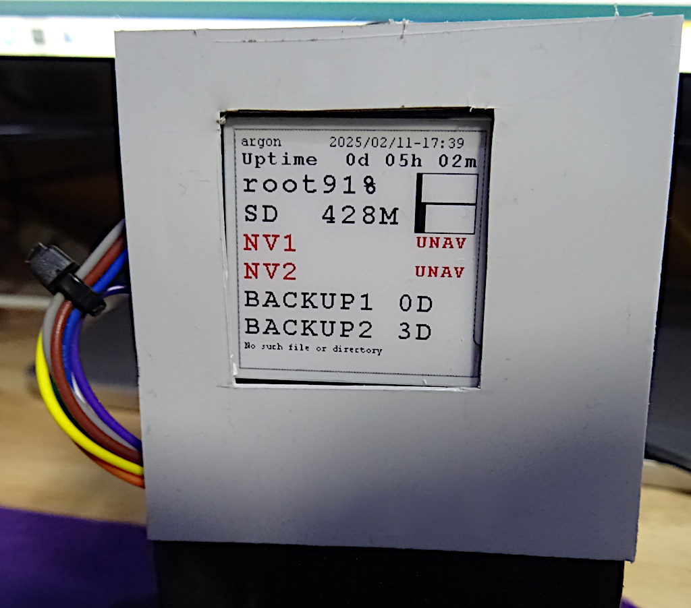

# einksysstat

A utility to display system stats on an eInk display, typically from a Raspberry Pi.


See: <https://www.youtube.com/watch?v=jRV1SOIkvbE>




Einkstat is free software: you can redistribute it and/or modify it under
the terms of the GNU General Public License as published by the Free
Software Foundation, either version 3 of the License, or (at your option)
any later version. 

Einkstat is distributed in the hope that it will be useful, but WITHOUT ANY
WARRANTY; without even the implied warranty of MERCHANTABILITY or FITNESS
FOR A PARTICULAR PURPOSE. See the GNU General Public License for more
details.

You should have received a copy of the GNU General Public License along
with Einkstat. If not, see <https://www.gnu.org/licenses/>.

Note included within Einkstat is code covered by a Public Domain (PD)
licence (which is indicated within those files) these sections
are subject to that PD licence. If you wish to use those portions
under "Public Domain" terms it is probably easier to use the original
found at e.g. https://github.com/waveshareteam/e-Paper.


# See:
	manual pages: einksysstat(1)  einksysstat.config(5)


# To INSTALL (from tarball):


Read: https://www.waveshare.com/wiki/1.54inch_e-Paper_Module_(B)_Manual#Working_With_Raspberry_Pi

In particular 'sudo raspi-config' and configure (enable) SPI...or edit /boot/config.txt and
add the line:

```
   dtparam=spi=on
```

then reboot.
   

Note these instructions are tested on Debain Bookworm. Other distributions may
use different package names/tools and may use a differnt mechanism (other than groups)
to grant permissions.

```
sudo apt-get install bison flex pandoc liblgpio-dev libproc2-dev gpiod

./configure
make

sudo sudo usermod -a -G gpio,spi $(id -un)  # Grant yourself permission to open the chip

logout & login again (to establish your new groups and hence permissions)
   
./einsysstat einksysstat.conf.disks
./einsysstat -i
```

Maybe do:

```
sudo make install
sudo make install-man
```

Then man einsysstat


